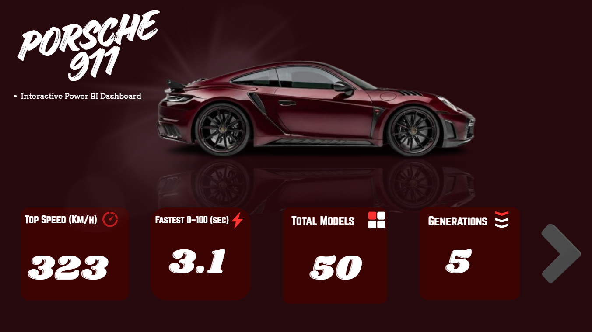
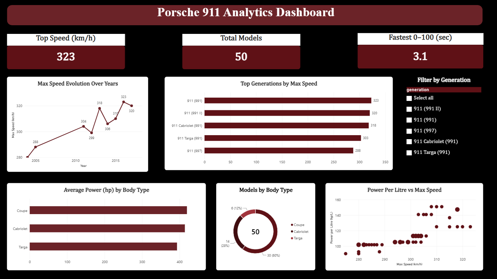

# Porsche 911 Analytics Dashboard

Interactive Power BI dashboard exploring performance and engineering
specs across Porsche 911 generations.

## Objective
How did Porsche 911 performance evolve across generations, and what
drives top speed?

## Dataset
50 Porsche 911 models with 60+ technical attributes.

## Data Cleaning (Power Query)
- Extracted horsepower as a numeric column from a text field
- Split and renamed engine detail columns
- Converted data types and removed unused columns

## Dashboard Pages
- **Cover**: project introduction and headline KPIs
- **Dashboard**: top speed, 0-100 time, generations comparison,
  speed evolution over the years, body types, power per litre vs top speed,
  and an interactive generation filter

## Key Insights
- 911 (991) is the fastest generation at 323 km/h, while 911 (997)
  is the slowest at 288 km/h
- Top speed rose from 288 km/h to 323 km/h across production years
- Higher power per litre goes with higher top speed
- Coupe makes up 60% of the models, Cabriolet 28%, Targa 12%
- Fastest 0-100 km/h time in the dataset is 3.1 seconds

## Tools
Power BI, Power Query, DAX, Canva

## How to Open
Download `porsche-911.pbix` and open it in Power BI Desktop.

## Author
Farida
